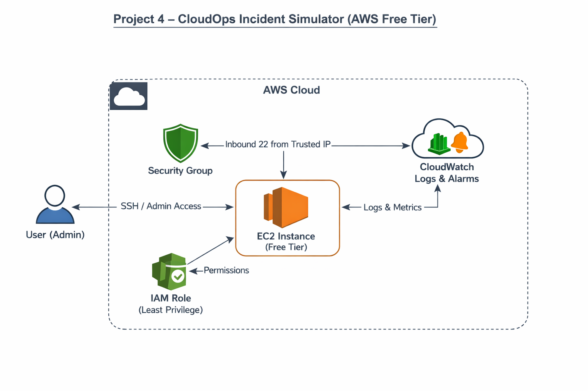

# Project 4 – CloudOps Incident Simulator (AWS Free Tier)

## Overview
This project simulates a real-world Cloud Operations (SysOps) environment on AWS.
It demonstrates how to deploy a minimal workload, monitor it, trigger an incident, and recover using operational tooling and runbooks.

The goal is to showcase production-style thinking: monitoring, alerting, failure simulation, recovery, and documentation.

## Architecture Diagram

## Architecture
- EC2 instance hosting a minimal workload
- Security Groups controlling inbound access
- IAM Role with least-privilege permissions
- CloudWatch Logs and Alarms for monitoring and alerting

## Objectives
- Deploy a minimal EC2 workload on AWS Free Tier
- Configure logging and monitoring
- Simulate an outage or failure
- Observe alarms triggering
- Recover the service
- Document incident response steps

## Incident Scenarios
- Stop EC2 instance
- Break inbound SSH rule
- Simulate CPU spike

## Runbook
See `runbook.md` for step-by-step incident response procedures.

## Cost Controls
- Free Tier eligible instance type
- Manual cleanup after testing
- No always-on paid services

## Purpose / What it Demonstrates

This project demonstrates:

- Designing AWS infrastructure with minimal resources (EC2, Security Groups, IAM Roles)
- Implementing monitoring and alerting using CloudWatch
- Simulating incidents (stopping EC2, breaking SSH, CPU spike)
- Executing recovery workflows and incident response
- Documenting operational processes for reproducibility

## Cleanup
Terminate EC2 instance after testing.
Delete CloudWatch alarms and logs.
